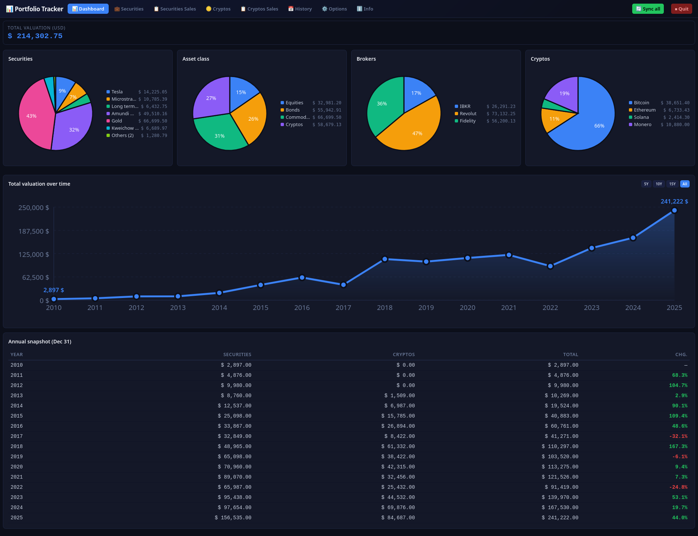
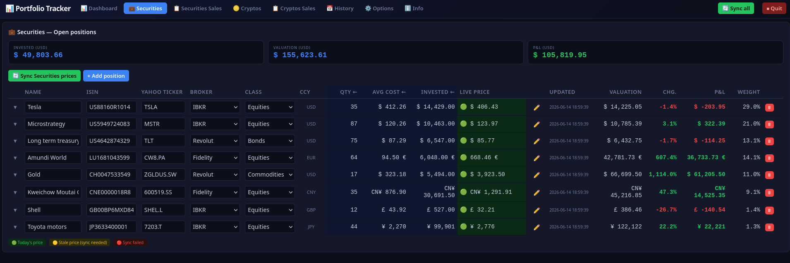
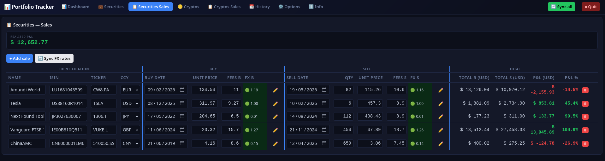
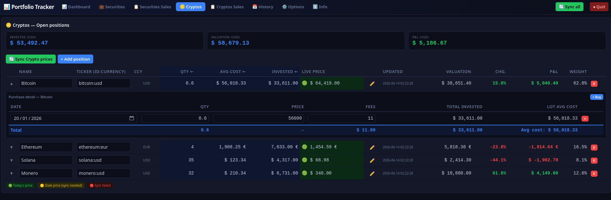
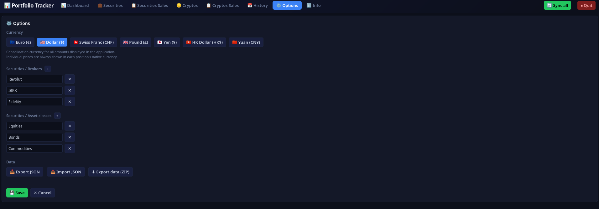

# 📊 Portfolio Tracker

A local, multi-currency investment portfolio tracker built in Python.
No cloud. No account. No subscription.

---

## Features

- **Securities** — open positions with purchase history, weighted average
  cost, live valuation, P&L and weight per position
- **Crypto positions** — same logic
- **Multi-currency** — EUR, USD, CHF, GBP, JPY, HKD and CNY supported;
  all values consolidated into a chosen reporting currency
- **Live price sync** — stock prices via Yahoo Finance (also used for daily
  FX rates); crypto prices via CoinGecko public API — all free, no API key
  required; one-click Sync all covers prices and FX in one shot
- **Sales tracking** — realized P&L for both Securities and Crypto
  disposals, with historical FX rates at transaction date (Frankfurter / ECB)
- **Dashboard** — total valuation, pie charts by asset class / broker /
  position, annual trend chart and year-over-year snapshot
  (Securities + Cryptos + Total)
- **Portfolio history** — manual annual snapshots with Dec 31 FX rates
  (Frankfurter / ECB); fixed columns Securities + Cryptos; sortable by year
- **Fully configurable** — brokers and asset classes defined freely
  in Options
- **CSV export** — timestamped ZIP with 6 CSV files (positions, sales,
  history and consolidated summary); computed P&L columns included;
  no external dependency

---

## Privacy & APIs

All personal financial data is stored locally in `portfolio_data.json`
and never leaves the machine.

External API calls are made only on explicit user request (🔄 button) —
no automatic background calls, no telemetry.

All external APIs are free, require no account and no subscription:

| API | Purpose | Key required |
|-----|---------|--------------|
| Yahoo Finance (`yfinance`) | Live stock prices and daily FX rates | No |
| CoinGecko public API | Live crypto prices | No |
| Frankfurter (ECB) | Historical FX rates — Sales (transaction date) + History snapshots (Dec 31) — from 1999-01-04 | No |

---

## Screenshots











---

## Quick start

### Linux / macOS

```bash
git clone https://github.com/carpediem-tools/portfolio-tracker.git
cd portfolio-tracker
python3 -m venv venv
source venv/bin/activate
pip install yfinance
python3 portfolio_tracker.py
```

For later runs, skip the install — just reactivate the environment and launch:

```bash
source venv/bin/activate && python3 portfolio_tracker.py
```

### Windows

```cmd
git clone https://github.com/carpediem-tools/portfolio-tracker.git
cd portfolio-tracker
python -m venv venv
venv\Scripts\activate
pip install yfinance
python portfolio_tracker.py
```

For later runs, skip the install — just reactivate the environment and launch:

```cmd
venv\Scripts\activate && python portfolio_tracker.py
```

Then the browser opens at `http://localhost:8080`.

Full user documentation available in-app at `http://localhost:8080/docs`.

---

## Data storage

All data is saved in `portfolio_data.json` in the project folder.
This file is generated at first launch and stays on the local machine only.
It can be backed up manually or exported as CSV from the Options tab.

---

## License

MIT
